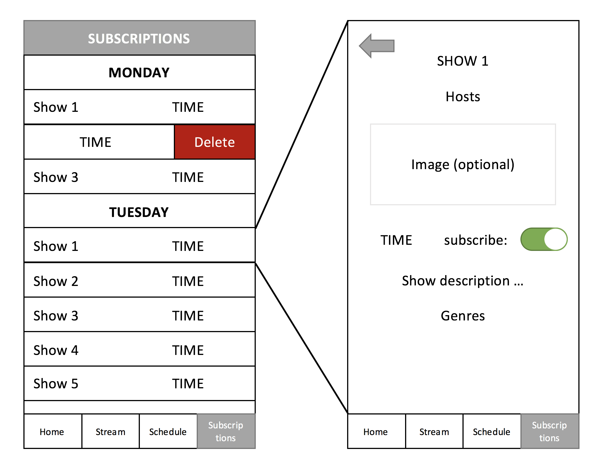

# Deliverables

### Group Name

WCMF 91.9

### Members

Matt and Justinas

## Vision Statement

This is an app for the Williams College radio station WCFM 91.9. It will allow users to stream the radio broadcast from their mobile devices and keep up to date with the radio programming. You'll never forget to tune into your favorite shows thanks to our built-in notification system. Download now to hear the voice of Williams College.

## Feature List

* Stream WCFM 91.9
        * Users can stream the radio station broadcast
        * Provides basic audio UI (adjust volume, etc.)
        * If no show is currently playing, it will display the next show
        * Stream should play even if user exits app (optional)
* Radio show schedule
        * Users can scroll through a table that contains all of the shows
        * Users can get additional information about a show by clicking on it
        * This list will be kept in sync with the website
* Radio show subscriptions
        * Users can subscribe to a show
        * Once subscribed, users can opt into receiving alerts on their phone when a show is starting
* Main launch screen (optional, do this last)
        * Displays currently playing show
        * Displays show up next
        * Displays songs of the week playlist (Spotify embed)

## UI Sketches

## Key Use Cases

### 1. Listen to the Stream

Main Path:

    1. Click the `Stream` tab
    2. If the user had previously paused the stream, press the play button

### 2. Subscribe to a show

Main Path:

    1. Click the `Schedule` tab
    2. Select a show from the schedule
    3. Swipe the switch to subscribe

### 3. Unsubscribe from a show

Main Path:

    1. Click the `Subscriptions` tab
    2. Swipe left on the show to unsubscribe
    3. Click `delete`

Alternate Path:

    1. Click the `Schedule` tab
    2. Select a show from the schedule
    3. If already subscribed, swipe the switch to unsubscribe

### 4. Stream is down

Main Path:

    1. Click the `Stream` tab
    2. The user will receive an error message

## Domain Analysis

To get the information for each show, our app has a scraper that visits the WCFM website and gets the HTML page. Then, a parser parses the HTML page and extracts the key information about each radio show. Then, our app can display this data in a scrollable table. The streamer sends a request to the WCFM stream link. It then feeds this audio into the app for users to listen to.

## Architecture

* RadioShow ADT
  * title : String
  * hosts : String
  * time : DateInterval or DateComponents
  * description : String
  * genres : String
  * photo : UIImage?
  * board : Bool

* Schedule ADT
   - Dictionary mapping each week day to a list of RadioShows that are on that day

* Parser
    - Scrapes website to get RadioShow information
    - Populates a JSON file

* TabBarController (main controller that splits app into 4 tabs)

1. HomeViewController

2. StreamViewController

3. ScheduleTableViewController

        ScheduleTableViewCell

4. SubscriptionTableViewController

        SubscriptionTableViewCell

* ShowDetailTableViewControll (static)
